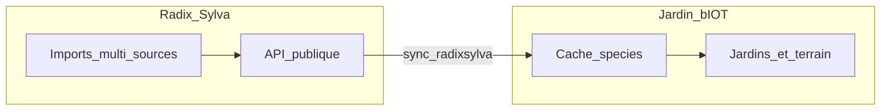

# Radix Sylva

[](https://www.python.org/)
[](https://www.djangoproject.com/)

**Base botanique de référence** pour le monde tempéré, avec un accent Québec / Canada : organismes, cultivars, relations de compagnonnage, amendements — alimentée par des **imports massifs** (Hydro-Québec, VASCAN, PFAF, etc.), **enrichissement** et **règles de fusion** entre sources. Ce n’est pas un fichier plat : chaque import est traçable, les conflits sont gérés, et le modèle est pensé pour évoluer avec la communauté et les partenaires données.

**En production** : API publique sur **[radix.jardinbiot.ca](https://radix.jardinbiot.ca)** — lecture, documentation OpenAPI, et flux **sync** pour les applications clientes.

---

## Pourquoi Radix existe

- **Une seule source de vérité** pour le catalogue botanique partagé entre projets (qualité, cohérence des noms, historique d’import).
- **Multi-sources** : agréger, prioriser et documenter plutôt que dupliquer des CSV figés.
- **Ouverture** : API REST versionnée pour que d’autres outils (dont **[Jardin bIOT](https://jardinbiot.ca)**) synchronisent un cache local sans refaire toute la chaîne d’import.

Le détail du modèle, des sources et des choix de fusion : [**docs/donnees-sources-et-modele.md**](docs/donnees-sources-et-modele.md).

---

## Lien avec Jardin bIOT

**Radix** construit et sert le **référentiel espèces** (tables `species_*`, imports, API). **Jardin bIOT** gère les **jardins**, **spécimens**, **terrain**, semences, utilisateurs : il conserve une **copie synchronisée** du catalogue via `sync_radixsylva`, pas une deuxième base maîtresse pour les espèces.



- Plan des phases : [plan-radix-biot-phases.md](../biot/docs/plan-radix-biot-phases.md) (dépôt BIOT)
- Endpoints sync et clés API : [**docs/api-sync.md**](docs/api-sync.md)

---

## Découvrir l’API

| Environnement | Base URL |
|---------------|----------|
| **Production** | https://radix.jardinbiot.ca/api/v1/ |
| **Exemple** | …/api/v1/organisms/ |

- **OpenAPI** : `/api/v1/schema/` · **Swagger** : `/api/v1/docs/`
- Contexte déploiement et runbooks : [**CONTEXT.md**](CONTEXT.md) · [**docs/deploy-digitalocean.md**](docs/deploy-digitalocean.md) · runbook BIOT : [deploy-radix-digitalocean-runbook.md](../biot/docs/deploy-radix-digitalocean-runbook.md)

---

## Démarrage rapide (développement)

```bash
git clone <ce-depot> && cd radixsylva
python3 -m venv .venv && source .venv/activate
pip install -r requirements.txt
cp .env.example .env
# Configurer PostgreSQL — voir docs/installation-locale.md
python manage.py migrate && python manage.py runserver 0.0.0.0:8001
```

**Guide complet** (Docker vs Homebrew, ports, URLs locales) : [**docs/installation-locale.md**](docs/installation-locale.md).

Opérations d’import et maintenance : [**docs/gestion-des-donnees.md**](docs/gestion-des-donnees.md).

---

## Documentation

| Document | Rôle |
|----------|------|
| [**docs/README.md**](docs/README.md) | Index du dossier `docs/`. |
| [**docs/installation-locale.md**](docs/installation-locale.md) | Prérequis, PostgreSQL, premier clone, migrations. |
| [**docs/api-sync.md**](docs/api-sync.md) | Pass technique, endpoints `/sync/*`, auth `X-Radix-Sync-Key`. |
| [**docs/donnees-sources-et-modele.md**](docs/donnees-sources-et-modele.md) | Modèle de données, sources, cultivars, conflits. |
| [**docs/gestion-des-donnees.md**](docs/gestion-des-donnees.md) | Imports et enchaînements opérationnels. |
| [**docs/env-et-deploiement.md**](docs/env-et-deploiement.md) | Variables `.env`, prod, bonnes pratiques. |
| [**CONTEXT.md**](CONTEXT.md) | Contexte technique, tables, déploiement, lien BIOT. |

---

Licence : **AGPL-3.0**, alignée sur l’écosystème [Jardin bIOT](https://jardinbiot.ca) (texte de référence sur le dépôt principal du projet).
